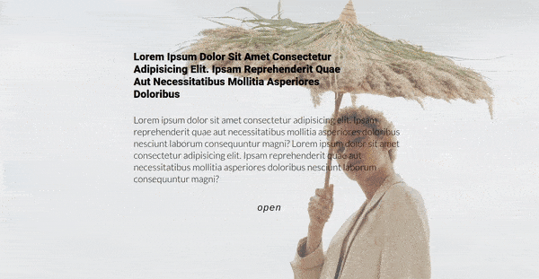

## [useState Exercises | Click events]()

#### Recap exercises | React 2022 🍨

- The lesson related to useStates can be found here [useState | Recap](https://github.com/nadiamariduena/react-recap-2022/tree/5-useState-counter) ( **it will be available soon**)

 
 

- Photography [cottonbro](https://www.pexels.com/fr-fr/@cottonbro/collections/)

