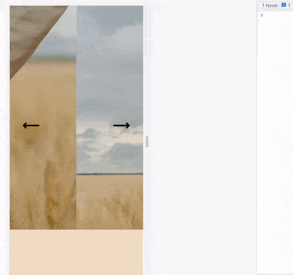
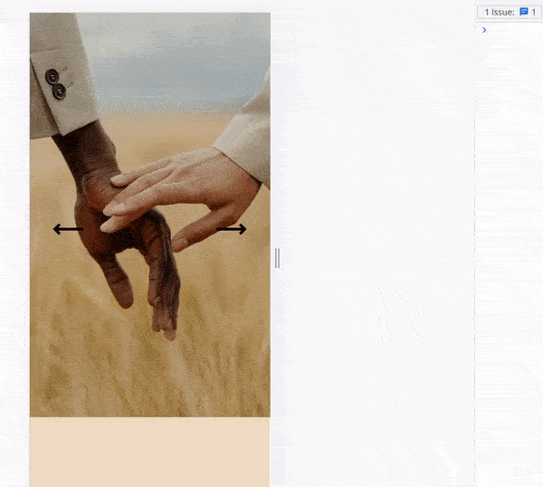
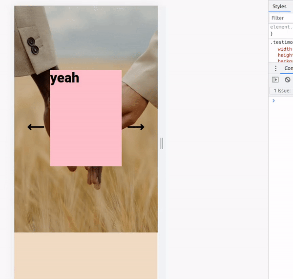
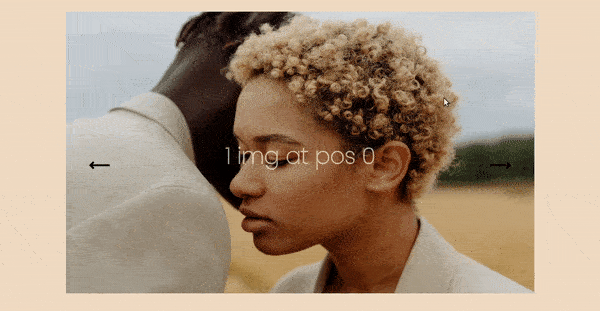

<br>

## 🌈

### Lets start by creating an array of images

```javascript
export const dataSlider = [
  {
    image:
      "https://images.pexels.com/photos/10679196/pexels-photo-10679196.jpeg?auto=compress&cs=tinysrgb&dpr=2&h=650&w=940",
  },
  {
    image:
      "https://images.pexels.com/photos/10679184/pexels-photo-10679184.jpeg?auto=compress&cs=tinysrgb&dpr=2&h=650&w=940",
  },
  {
    image:
      "https://images.pexels.com/photos/10679176/pexels-photo-10679176.jpeg?auto=compress&cs=tinysrgb&dpr=2&h=650&w=940",
  },
];
```

<br>

### Now Create the component to nest the images

- map the images to see if they are showing

```javascript
//
//
const TestimonialFront = () => {
  return (
    <>
      <section className="testimonial-front">
        <h1>Testimonial</h1>

        {/*  */}

        <div>
          // nesting and mapping the images ✋
          {dataSlider.map((item, index) => {
            const { image } = item;
            return ;
          })}
        </div>

        {/*  */}
      </section>
    </>
  );
};

export default TestimonialFront;
```

<br>
<br>

# 🍨

<br>

### Now lets set up the <u>States</u>

**1.** We will set up the current state:

<br>

> **By default** the state will be at cero, and the reason for that is because if we set the state, without telling it that we want the **current** it will lag, and it will get the previous value without the current, [read more about this issue in this repo](https://github.com/nadiamariduena/react-recap-2022/tree/5-useState-counter), **Look for 'current'**

<br>

```javascript
import React, { useState } from "react";
import { dataSlider } from "../dataSlider";

//
//
const TestimonialFront = () => {
  //
  const [current, setCurrent] = useState(0); // ✋


  //
  return (
    <>
```

<br>
<br>

### Add this to the 'TestimonialFront'

- It will show an error but you will solve it in the next step

```javascript
const length = slides.length;
```

### Then Go to the Home.jsx and add the prop

- This prop will pass the data from one component to the other

<br>

###### Home.jsx

<br>

```javascript
import { dataSlider } from "./dataSlider";
//
const Home = () => {
  return (
    <>
      {/* <Modal /> */}
      <TestimonialFront slides={dataSlider} /> 👍 slides prop
    </>
  );
};
```

<br>

###### TestimonialFront.jsx

<br>

```javascript
//
//
const TestimonialFront = (slides) => { ✋
  //
  const [current, setCurrent] = useState(0);
  const length = slides.length; ✋
```

<br>
<br>

---

<br>

### Add the Arrow icons

- You can either install this [react-icons](https://react-icons.github.io/react-icons/)

##### [arrows](https://react-icons.github.io/react-icons/search?q=arrow)

```javascript
npm install react-icons
```

##### Remember to add the 'identifier' at the end of the import

- For example, my icons start with **IoIos** , so in the import you have to add the **/io** , like so:

```javascript
import { IoIosArrowForward, IoIosArrowBack } from "react-icons/io";
```

<br>

- Or just use some html symbols

##### [HTML arrows](https://www.toptal.com/designers/htmlarrows/arrows/) ✋

<br>

#### Once you have that, import the icons

```javascript
import React, { useState } from "react";
import { dataSlider } from "../dataSlider";
import { CgArrowLongLeft, CgArrowLongRight } from "react-icons/cg"; ✋

//
//
const TestimonialFront = (slides) => {
  //
  const [current, setCurrent] = useState(0);
  const length = slides.length;

  //
  return (
    <>
      <section className="testimonial-front">
        <h1>Testimonial</h1>

        <div className="slider">
          <CgArrowLongLeft /> ✋
          <CgArrowLongRight /> ✋{/*


          */}
          {dataSlider.map((item, index) => {
            const { image } = item;

            return ;
          })}
        </div>
      </section>
    </>
  );
};

export default TestimonialFront;
```

<br>
<br>

---

<br>

# Styles 🥭

<br>

### The Containers/parents

```scss
//
.testimonial-front {
  width: 100vw;
  min-height: 100vh;
  padding: 0 0 3vh 0;
  background-color: rgb(240, 219, 195);

  // If you add display flex settings here, things will break 🔴
  //
  font-family: "RobotoBlack";
  font-size: calc(20px + 1vmin);
}
//

.slider {
  position: relative;
  height: 70vh;
  display: flex;
  justify-content: center;
  align-items: center;
}
```

#### the arrows

<br>

- Add a **className** to both of them

```javascript
          <CgArrowLongLeft className="left-arrow" />
          <CgArrowLongRight className="right-arrow" />
```

<br>

# 🍨

#### to direct the arrows to the container parent, do the following:

- Add a position **relative** to the **className="slider"**

> **The position relative** should always go inside the parent. container
> **the position:relative** works as a lighthouse, in which the children are the boats, the children will carry a **position:absolute** for this to work

<br>
<br>

```scss
.left-arrow {
  position: absolute;
  top: 50%;
  left: 32px;
  //
  font-size: 3rem;
  color: #000;
  z-index: 1;
  cursor: pointer;
  user-select: none;
}
.right-arrow {
  position: absolute;
  top: 50%;
  right: 32px;
  //
  font-size: 3rem;
  color: #000;
  z-index: 1;
  cursor: pointer;
  user-select: none;
}
```

#### This is what we have

```scss
//
.testimonial-front {
  width: 100vw;
  min-height: 100vh;
  padding: 0 0 3vh 0;
  background-color: rgb(240, 219, 195);

  //
  font-family: "RobotoBlack";
  font-size: calc(20px + 1vmin);

  //

  .slider {
    position: relative;
    height: 70vh;
    display: flex;
    justify-content: center;
    align-items: center;

    //
    .left-arrow {
      position: absolute;
      top: 50%;
      left: 32px;
      //
      font-size: 3rem;
      color: #000;
      z-index: 1;
      cursor: pointer;
      user-select: none;
    }
    .right-arrow {
      position: absolute;
      top: 50%;
      right: 32px;
      //
      font-size: 3rem;
      color: #000;
      z-index: 1;
      cursor: pointer;
      user-select: none;
    }

    //
    .img-box {
      width: 1000px;
      height: 600px;
    }
  }

  //
}
```

<br>
<br>

---

<br>
<br>

### The Slider Logic

<br>

```javascript
//if our slides, dont have an array and if our array is not an array type
//  OR || the slides, which is the images, has less or equal than 0,
// then return null
if (!Array.isArray(slides) || slides.length <= 0) {
  return null;
}
```

<br>
<br>

### nextSlide 🍊

<br>

#### If you are familiar with arrays you know they start at 0, so if we have 4 images we deduce 1, so in total we will have 3 and then it will reset it and go back to '0 :' :else

```javascript
const nextSlide = () => {
  setCurrent(current === length - 1 ? 0 : current + 1);
};
console.log(current);
```

<br>

##### When i have 4 img

- As you can see, the first time i click, it start with 1, then once i reach the end of the length, it goes back to 0

[]()

##### When i have 3 img

[]()

<br>

### prevSlide 🍊

> If **current** is equal to 0 (**so essentially, its back on the main of our images**), then I want to set the **length to be - 1** , else:, I am going the set the current to **subtract 1**

```javascript
const prevSlide = () => {
  setCurrent(current === 0 ? length - 1 : current - 1);
};
```

[]()

<br>
<br>

---

<br>

### Showing the images

- Nest the map function inside a new div, add a condition inside the **className** to see if the user is sliding

```javascript
<div className={index === current ? "slide active" : "slide"} key={index}>
  
</div>
```

<br>

```javascript

```

[]()

#### You can also add text

```javascript
{
  index === current && (
    <>
      {" "}
      
      <div className="text-box">
        <h2>{item.desc}</h2> //add another property inside the dataSlider.js
      </div>
    </>
  );

  /*
  export const dataSlider = [
  {
    id: 0,
    desc: "1 img at pos 0",
    image:
      "https://images.pexels.com/photos/10679196/pexels-photo-10679196.jpeg?auto=compress&cs=tinysrgb&dpr=2&h=650&w=940",
  },
  
  
  
  */
}
```

<br>

### ⚠️ Some Issues

#### IN the beginning I said that adding display flex + centering will break it, yes it will but at the end of the project you can actually add it

```scss
.testimonial-front {
  width: 100vw;
  min-height: 100vh;
  padding: 0 0 3vh 0;
  background-color: rgb(14, 14, 14);
  display: flex;
  justify-content: center;
  align-items: center;
  flex-direction: column;
  //

  font-family: "RobotoBlack";
  font-size: calc(20px + 1vmin);

  //
```
